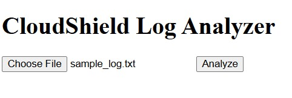
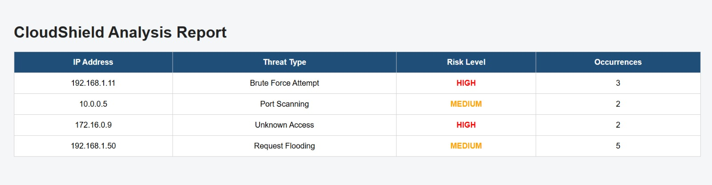
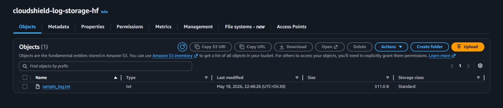

# CloudShield

CloudShield is a cloud-based log monitoring and threat detection system built using Flask, Python, and AWS S3.

It analyzes uploaded log files, detects suspicious network/security activity, and stores uploaded logs securely in Amazon S3 for cloud-backed monitoring.

## Features

- Upload log files through web interface
- Detect brute-force login attempts
- Detect port scanning activity
- Detect unknown IP access
- Detect excessive request flooding
- Display threat analysis dashboard
- Store uploaded logs in AWS S3 bucket
- Modular Python backend design

## Tech Stack

- Python
- Flask
- AWS S3
- Boto3
- HTML/CSS
- GitHub

## Project Structure

```text
CloudShield/
├── app.py
├── requirements.txt
├── uploads/
├── data/
├── screenshots/
├── templates/
│   ├── index.html
│   └── result.html
└── src/
    ├── parser.py
    ├── detector.py
    └── cloud_upload.py
```


## How It Works

1. User uploads a log file  
2. Flask saves file locally  
3. File is uploaded to AWS S3 bucket  
4. Log entries are parsed  
5. Threat patterns are detected  
6. Analysis report is shown in browser  

## Screenshots

### Upload Interface


### Threat Detection Dashboard


### AWS S3 Cloud Storage


## Sample Threat Detection

The system currently detects:

- Brute Force Attempt
- Port Scanning
- Unknown Access
- Request Flooding

## Future Enhancements

- Real-time log streaming
- Email alerts for high-risk attacks
- Dashboard charts
- Live deployment
- Machine learning anomaly detection

## Author

HF
